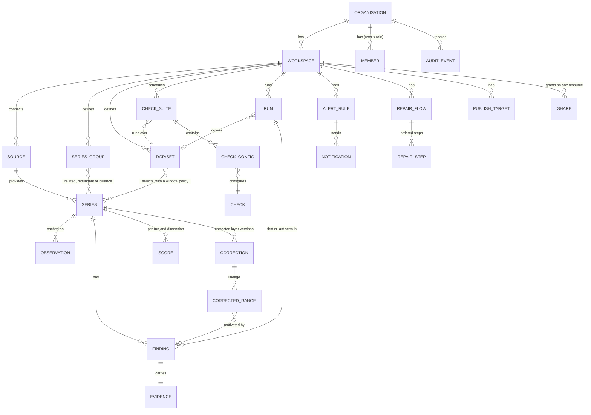

# Domain model

The vocabulary used across core, API, UI and docs. Names are deliberately boring.

## Entities

| Entity | Meaning | Key attributes |
|---|---|---|
| **Organisation** | Tenant. Billing, SSO, global admins. | id, name, sso_config, plan |
| **Workspace** | Isolation unit inside an organisation (a plant, a fleet, a team). | id, org_id, name, timezone |
| **Source** | A connector instance to an external system. | type (pi_web_api, opc_ua, parquet, csv, sql, mqtt...), credentials_ref (secret store key), poll_policy, health |
| **Series** | One time series ("tag", "point", "channel"). | source_id, external_id, name, unit, dtype, expected_interval, physical_min/max, operational_min/max, asset_path, kind (measurement, setpoint, counter, status), quality_semantics |
| **Observation** | A (timestamp, value, quality) triple. Never stored long-term by Tabayyun except as a cache. | ts, value, quality_flag |
| **SeriesGroup** | Series that belong together, and how: `related` (usually move together), `redundant` (measure the same quantity) or `balance` (inputs and outputs that should close). Cross-series checks run per group (spec 008). | name, kind, members (series_id, role: member / input / output), params |
| **Dataset** | Named group of Series with a time-range and resampling policy used by a check suite. | series selection (explicit or query), window policy |
| **Check** | A *definition* shipped by Tabayyun or a plugin: id, category, dimension, parameters schema, evidence schema, default thresholds, docs. | id (`tby.stale_data`), version, dimension, severity_default |
| **CheckConfig** | A Check bound to a Dataset/Series with concrete parameters. | check_id, params, severity, enabled |
| **CheckSuite** | Ordered set of CheckConfigs with a schedule. | schedule (cron / on-arrival), dataset_id |
| **Run** | One execution of a suite over a window. | started_at, window, status, stats |
| **Finding** | One detected issue on one Series in one Run. | check_id, series_id, window [start,end), severity, score_impact, summary, evidence_ref, status (open/acked/resolved/muted) |
| **Evidence** | Machine-readable facts backing a finding (statistic, threshold, baseline window, sample points). | JSON blob following the check's evidence schema |
| **Score** | 0–100 per Series per dimension and overall, plus roll-ups. | dimension, value, computed_at, method_version |
| **AlertRule** | Condition over findings/scores → notification channel. | condition, channel (email, webhook, slack, teams), throttle |
| **RepairFlow** | Ordered steps applied to a Dataset on a schedule or on demand: filter, impute, align, resample, clamp, replace, custom Python. | steps[], trigger (manual / after run / cron), approval_policy |
| **Correction** | One applied repair (manual or from a flow) creating a new version of a Series' corrected layer. Never mutates raw data. | series_id, version, method (`linear`, `like_day`, `kalman`, `drop`, `clamp`, `manual_value`...), source (user / flow / finding), status (proposed / approved / rejected / published), approved_by, reason |
| **CorrectedRange** | Point-level lineage inside a Correction: which timestamps changed, from what, to what, why. | correction_id, window, original_values_ref, new_values_ref, finding_id?, method_params |
| **PublishTarget** | Destination for corrected series: Parquet export, SQL table, PI/OPC write-back tag, API. | type, config, mapping raw→corrected tag names |
| **Share** | Grant of a permission on a resource to a user, team or link. | resource_type, resource_id, principal (user/team/link), role, expires_at, token_hash |
| **AuditEvent** | Immutable who/what/when. | actor, action, target, ip, ua, ts |

## Raw vs corrected layers

A Series has an immutable **raw layer** (what the source delivered) and zero or more
**corrected layers** (versions). Reads specify a layer: `raw`, `corrected@latest`, or
`corrected@v3`. Scores are computed for both layers so the effect of a correction is
visible ("raw 61 → corrected 94"). Every corrected point carries lineage back to a
Correction and optionally to the Finding that motivated it.

## Quality dimensions

Every check declares exactly one primary dimension. Scores roll up per dimension.

| Dimension | Question | Example checks |
|---|---|---|
| **Completeness** | Is data there when it should be? | gaps, missing intervals, coverage ratio, NaN ratio |
| **Timeliness** | Is data fresh and on time? | staleness, latency, expected-interval violations |
| **Validity** | Is each value structurally and physically possible? | range limits, unit/scale, dtype, NaN/Inf, negative for non-negative quantities |
| **Accuracy** | Does the value reflect reality? | sensor drift vs redundancy, bias vs reference/clear-sky, calibration shift |
| **Consistency** | Do related signals agree? | correlation breaks, energy balance, interval sum vs register, status vs value |
| **Plausibility (behavioural)** | Does the series behave like it used to? | stuck/flatline, spikes, variance drift, distribution drift, seasonality break, changepoints |
| **Uniqueness / integrity** | Are timestamps and identities sound? | duplicates, out-of-order, DST artefacts, clock skew |

## Scoring (v2)

- Each Finding has `score_impact ∈ [0,1]` = severity weight × fraction of window affected.
- Within a dimension, findings are merged on the time axis: impact = ∫ max severity weight
  over the evaluation window ÷ window duration, so two checks flagging the same minute count
  once at the higher severity. Point findings (single samples) add their own impact.
- Series dimension score = `100 × (1 − clip(impact, 0, 1))`.
- Series overall = weighted mean of dimension scores (default weights editable per workspace).
- Dataset / workspace score = mean of series overall, plus "worst 5%" shown next to it,
  because averages hide the tags people actually care about.
- Scores are versioned by `method_version` so historical scores stay comparable when the
  method changes.
