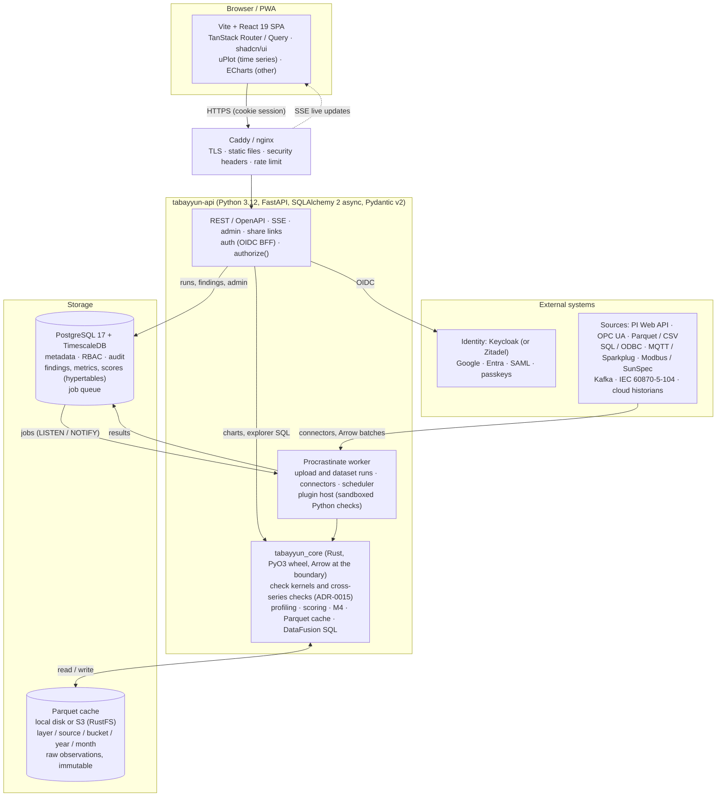
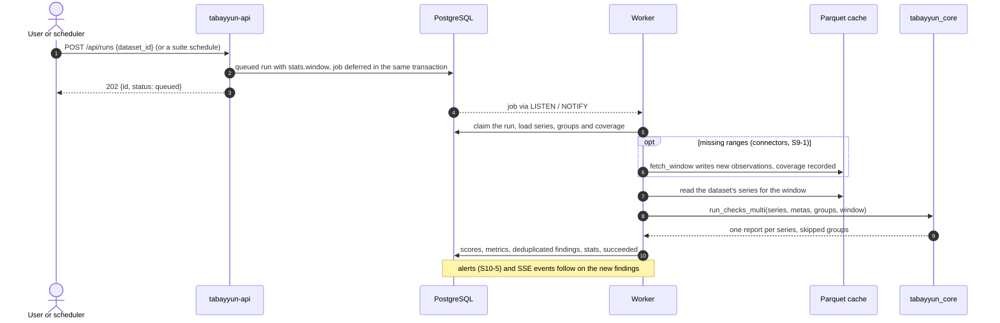

# System architecture

Decisions are recorded in `docs/adr/`. This document is the map. Research backing is in
`docs/research/03-frontend-auth-security.md` and `docs/research/04-backend-core-stack.md`.

## Overview

## Components

### 1. `tabayyun_core` (Rust)

| Module | Responsibility |
|---|---|
| `frame` | `SeriesFrame` type: `Vec`-backed ts (ns, UTC), values, quality and optional ingest times plus metadata; conversion from and to Arrow record batches at the boundary; sorting and de-duplication. |
| `profile` | Per-series profile: sampling interval (mode of IAT), value stats (robust), unique-value count, resolution, quality-flag mix, seasonality (augurs), autocorrelation. Profiles are the *baseline* for adaptive thresholds. |
| `checks` | One module per check; each implements `Check::run(&SeriesFrame, &CheckContext) -> CheckOutput` (findings, metrics, skips) as a pure kernel (ADR-0015); cross-series checks implement `CrossCheck` over a series group (spec 008). Registry maps `check_id` to implementation. |
| `score` | Dimension and overall scores from findings; versioned by `method_version`. |
| `repair` | Repair operations over `SeriesFrame`s: drop/mask, clamp, linear and seasonal interpolation, like-day estimation, Kalman smoothing, resample/align, offset/scale correction; each returns the new values plus a lineage frame. |
| `downsample` | M4 and MinMaxLTTB for chart endpoints. |
| `cache` | Parquet cache on local disk or S3-compatible storage through `object_store`: layout, writer (append-only, sorted row groups, zstd), reader (pruning by series and time). Spec 006. |
| `sql` | DataFusion session over the cache for explorer queries and SQL checks; read-only, statement timeout, row limit. |
| `py` | PyO3 bindings. Accepts and returns Arrow C stream capsules; releases the GIL for compute; converts Rust errors into typed Python exceptions. |
| `cli` | `tabayyun-core` binary for offline batch runs and benchmarks (no Python needed). |

Rules: no I/O in `checks`; every check has a synthetic-data unit test, a property test and a
golden fixture; every kernel has a criterion benchmark.

### 2. `tabayyun-api` (Python)

| Package | Responsibility |
|---|---|
| `auth` | OIDC Authorization Code + PKCE client against the IdP, server-side session store, `__Host-` cookie, CSRF header check, back-channel logout. |
| `authz` | `authorize(principal, action, resource)`, `visible_ids(principal, resource_type)`, role hierarchy, share resolution, RLS context (`SET LOCAL app.org_id`). |
| `orgs`, `workspaces`, `members`, `teams`, `invitations` | Tenant model and admin panel APIs. |
| `sources`, `series`, `datasets` | Connector configuration, series catalogue, metadata import (PI AF, OPC UA address space, CSV). |
| `connectors` | Plugin-style connector framework; each connector yields Arrow batches; runs in the job worker, never in the request path. |
| `checks`, `suites`, `runs`, `findings`, `scores` | Check registry (built-in from core + plugin manifests), suite scheduling, run execution, results persistence. |
| `alerts` | Rules, channels (email, webhook, Slack/Teams), throttling. |
| `shares` | Share grants and link tokens. |
| `repairs` | Repair flows, corrections, approval, corrected-layer versions, publish targets and write-back jobs. |
| `audit` | Append-only audit events. |
| `plugins` | Manifest loading, sandboxed execution of Python checks. |
| `jobs` | Procrastinate tasks: `fetch_window`, `profile_series`, `run_suite`, `compute_scores`, `deliver_alert`, `expire_shares`. |

### 3. Frontend (TypeScript)

Single-page app. Routes: `/login`, `/w/:workspace/overview`, `/series/:id`, `/findings`,
`/suites`, `/sources`, `/datasets`, `/alerts`, `/admin/*`, `/share/:token`. Details in
`docs/frontend/01-frontend-design.md`.

### 4. Identity provider

Keycloak (Apache-2.0) is the default in the compose bundle; Zitadel is a supported
alternative. Tabayyun never stores passwords. Google login is a brokered identity provider
in the IdP; enterprise SSO is a per-organisation OIDC/SAML connection.

## Data flow of a run

1. Scheduler enqueues `run_suite(suite_id, window)`; a user starts one with `POST /api/runs
   {dataset_id}` (spec 008, trigger `manual`).
2. Worker resolves the dataset to a series list, checks the Parquet cache for coverage, and
   enqueues `fetch_window` jobs for missing ranges per source (connector-specific batching
   and rate limits).
3. Connector writes new observations to the cache (append-only, idempotent by
   `(series, ts)`), and records coverage.
4. Worker calls `core.run_checks_multi(series_batches, metas, groups, window)`; Rust runs each
   check as a kernel over each series with its own profile and each cross-series check over
   every series group whose members all have data, on one grid (`align`), and returns one
   report per series plus the skipped groups (spec 008, ADR-0015).
5. Python persists findings (deduplicating against open findings with overlapping windows,
   and of the same group for cross-series findings; ADR-0013), metrics (hypertable), and
   updated scores, per series in one transaction.
6. Alert rules are evaluated on the new findings; notifications are enqueued.
7. SSE publishes `run.completed` and `finding.created` events to connected clients.

## Data flow of a correction

The stages of one correction (the status names settle with corrections v1 in sprint 11; only
*proposed* is fixed so far):

```mermaid
stateDiagram-v2
    direction LR
    [*] --> Proposed: window on a chart or a finding,<br/>or a RepairFlow after a suite run
    Proposed --> Computed: apply_repair writes corrected layer vN<br/>and lineage; raw stays untouched
    Computed --> Approved: editor approves,<br/>or the flow auto-approves
    Computed --> Rejected: editor rejects
    Approved --> Published: publish_correction to PublishTargets<br/>(never the original source tag)
    Rejected --> [*]
    Published --> [*]
```

1. A user selects a window on a series chart (or a finding's window) and picks an operation,
   or a RepairFlow runs after a suite run over the findings it is configured to handle.
2. The API creates a `Correction` in status *proposed* and enqueues `apply_repair`.
3. The worker loads the raw layer plus the current corrected layer, calls
   `core.repair(op, params)` and receives new values and a lineage frame; it writes a new
   corrected-layer version to the cache (`layer=corrected, version=n`) and the lineage rows
   to Postgres. Raw data is never modified.
4. The UI shows raw vs corrected with a diff; the corrected layer is re-scored so the user
   sees the quality gain. Per the workspace approval policy, an editor approves or the flow
   auto-approves.
5. On approval, `publish_correction` delivers the corrected series to configured
   PublishTargets (Parquet/SQL export, PI/OPC write-back to a *separate* tag, API). Publishing
   to the original source tag is never done.
6. Accepted and rejected corrections are audit-logged and feed the threshold-suggestion job.

## Storage layout

- **Postgres:** `orgs`, `workspaces`, `users`, `memberships`, `teams`, `sources`, `series`,
  `datasets`, `series_groups`, `checks`, `check_configs`, `suites`, `runs`, `findings` (hypertable on
  `window_start`), `metrics` (hypertable), `scores` (hypertable), `alert_rules`,
  `notifications`, `shares`, `audit_events`, `procrastinate_*`.
- **Parquet cache:** `cache/{layer}/{source_id}/{tag_bucket}/{year}/{month}/part-*.parquet` where `layer` is `raw` or `corrected/v{n}`, columns
  `series_id, ts, value_f64, value_i64, value_bool, value_str, quality`, sorted by
  `(series_id, ts)`, row groups ~1M rows, zstd. A `coverage` table in Postgres records which
  ranges are present so fetches are incremental.

## Deployment shapes

| Shape | Contents | Use |
|---|---|---|
| `docker compose` bundle | api, worker(s), frontend (static in Caddy), Postgres+Timescale, Keycloak, optional S3-compatible store (any; the bundle uses RustFS since MinIO community builds ended in 2025) | default, air-gapped tarball |
| Helm chart | same, with HPA for workers | Kubernetes customers |
| `tabayyun-core` CLI | Rust binary | offline profiling, CI checks, benchmarks, edge pre-checks |

## Cross-cutting

- **Observability:** OpenTelemetry traces/metrics in both languages; Prometheus endpoint;
  structured JSON logs without PII; per-run metrics (series/sec, cache hit ratio).
- **Configuration:** environment variables and mounted secret files only; `.env.example`
  documents every variable; startup validates config and refuses to run with defaults for
  secrets.
- **Licensing:** Ed25519-signed offline licence file with entitlements (series count, check
  packs, seats); verified in core.
- **Versioning:** check semantics and score method are versioned; runs record the versions
  used so historic scores remain interpretable.
