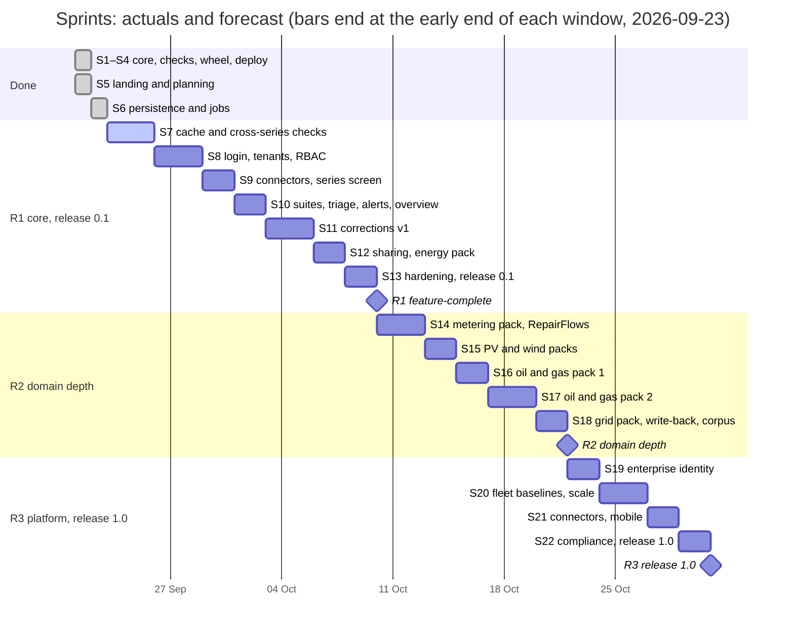

# Sprint plan — scope sprints with a rolling forecast

*Planned 2026-09-21 as weekly sprints; re-baselined 2026-09-23. Sprints 1–6 took three
days (21–23 Sep), so the weekly calendar described the budget cycle rather than the work.
A sprint is now a unit of scope: it starts when the previous sprint's last PR is merged,
its stories are ordered by priority, and its dates are recorded when it happens. Dates for
the sprints ahead are a forecast, recomputed at the end of every sprint (see
[Actuals and forecast](#actuals-and-forecast)). One branch per sprint (`sprint/NN-topic`),
one PR per spec, CodeRabbit review, merge by the owner, release from `main` deploys to
CapRover.*

The build budget still resets every Saturday. When it reaches ~90 % the remaining stories
roll into the next budget week unchanged; nothing is squeezed in. The forecast absorbs these
stops, so a budget stop moves dates, not scope.

Sizing from sprints 1–6: one session implements one spec (one story, sometimes two) with
tests, review fixes and a live check. Six checks with tests fit one sprint, and so does one
vertical slice through persistence, API and web. Sprint 6 (five specs) took about 20 hours
of wall-clock time from the first spec merge to the last PR going green. Research notes are cheap
and go last in a sprint if budget remains. Priorities: **M** must (sprint fails without it),
**S** should, **C** could.

Every story gets a spec in `docs/specs/` (copy `000-template.md`) before implementation;
sprint 6 stories map to specs 001–005. `TASKS.md` tracks the specs and session decisions.

Definition of done for every story: tests (Rust unit or pytest or vitest), lint clean, docs
touched (`catalogue.md`, ADR when a design decision is made, roadmap progress log), and,
for user-facing stories, a screenshot or curl transcript in the PR.

## Milestones

| Milestone | Sprints | Original plan | Forecast (2026-09-23) | Exit criteria |
|---|---|---|---|---|
| **R1 core, release 0.1** | 5–13 | 21 Nov 2026 | feature-complete 10–18 Oct; release when the pilot install is validated | 30 checks; persisted runs, findings, scores; PI Web API and OPC UA connectors; Google login, workspace RBAC; overview, series detail, findings inbox; alerts; corrections with lineage and a corrected layer; share links; pilot install on Hetzner; ≥95 % of injected faults detected at ≤2 % false positives per check |
| **R2 domain depth** | 14–18 | 26 Dec 2026 | 22 Oct – 5 Nov | metering, PV, wind, grid, oil and gas packs; RepairFlows with regulatory estimation; write-back; public benchmark corpus |
| **R3 platform, release 1.0** | 19–22 | 23 Jan 2027 | 31 Oct – 19 Nov | enterprise SSO and SCIM, API tokens, embeds, fleet baselines, multi-node workers, more connectors, SOC 2 pack, licensing |

A forecast window is software scope only. Items that wait on people or third parties (the
pilot site, an external pen test, test tenants, store accounts) do not compress with it;
they are listed under [Owner and external dependencies](#owner-and-external-dependencies)
with the sprint that needs them.

## Actuals and forecast

Actual dates are UTC merge dates. Measured pace so far: about one sprint per working day.
The forecast deliberately plans at **2–3 sprints per week** (3.5 to 2.3 days each), a third
to a half of the measured pace, because sprints 7–13 carry more research, third-party
software (Keycloak, PI Web API, OPC UA) and performance work than sprints 1–6, and because
budget stops and review rounds are part of the calendar. Late December runs at half
capacity whichever sprint falls there. At the end of each sprint: fill in its row, recompute
the forecast from the last three sprints, and update the milestones table.

The chart is the table below drawn on a calendar; when a sprint ends, update both.

| Sprint | Topic | Originally planned | Actual / forecast end | PRs |
|---|---|---|---|---|
| 1 | workspace, first eight checks, CLI | before the plan | done 21 Sep | #1, #2 |
| 2 | profile, six checks, M4, PyO3 wheel, upload page | before the plan | done 21 Sep | #3 |
| 3 | drift checks, scoring v2, release pipeline | before the plan | done 21 Sep | #4 |
| 4 | CapRover deploy, research 05, historian timestamps | before the plan | done 21 Sep | #6 |
| 5 | landing and planning | 20–26 Sep | done 22 Sep (S5-3 with the owner) | #5, #7, #15, #16, #22–#24 |
| 6 | persistence and jobs | 27 Sep – 3 Oct | done 23 Sep | #25–#29 |
| 7 | Parquet cache and cross-series checks | 4–10 Oct | 26–28 Sep | |
| 8 | login, tenants and RBAC | 11–17 Oct | 29 Sep – 1 Oct | |
| 9 | connectors and the series screen | 18–24 Oct | 1–4 Oct | |
| 10 | suites, triage, alerts, overview | 25–31 Oct | 3–8 Oct | |
| 11 | corrections v1 | 1–7 Nov | 6–12 Oct | |
| 12 | sharing and the energy pack | 8–14 Nov | 8–15 Oct | |
| 13 | hardening and release 0.1 | 15–21 Nov | 10–18 Oct | |
| 14 | metering pack and RepairFlows | 22–28 Nov | 13–22 Oct | |
| 15 | PV and wind packs | 29 Nov – 5 Dec | 15–26 Oct | |
| 16 | oil and gas pack 1 | 6–12 Dec | 17–29 Oct | |
| 17 | oil and gas pack 2 | 13–19 Dec | 20 Oct – 1 Nov | |
| 18 | grid pack, write-back, benchmark corpus | 20–26 Dec | 22 Oct – 5 Nov | |
| 19 | enterprise identity | 27 Dec – 2 Jan | 24 Oct – 9 Nov | |
| 20 | fleet baselines and scale | 3–9 Jan | 27 Oct – 12 Nov | |
| 21 | connectors and mobile | 10–16 Jan | 29 Oct – 15 Nov | |
| 22 | compliance and release 1.0 | 17–23 Jan | 31 Oct – 19 Nov | |

## Owner and external dependencies

At the measured pace the owner's actions, not the build, become the critical path. Each item
is needed before the named sprint starts; the date is the early end of the previous sprint's
forecast window.

| Needed by | Item | Owner action |
|---|---|---|
| now | S5-3 | confirm the api app's session secret is generated; delete merged branches |
| S7 (now) | cache store | done 23 Sep: RustFS 1.0 on CapRover (replacing an unmaintained MinIO), bucket `tabayyun-cache`, a key limited to it, worker env set; retire the old `minio` and `minio-api` apps |
| S8 (~26 Sep) | Google login | Google Cloud OAuth client (web) with redirect URI `https://miftachun.apps.data-and-ai-dude.ch/realms/tabayyun/broker/google/endpoint` (Keycloak brokers Google); id and secret go to Keycloak's Google provider via env at realm import |
| S8 (~26 Sep) | Keycloak | done 23 Sep: `miftachun.apps.data-and-ai-dude.ch` (one realm per product; `tabayyun` realm imported in S8-1); owner still to replace the bootstrap admin and enable OTP |
| S8 (~26 Sep) | email | SMTP account and credentials (invitations in S8-4, alerts in S10-5) |
| S9 (~29 Sep) | PI Web API | optional: read access to a PI Web API test server; without it the connector is tested against recorded fixtures only |
| S13 (~8 Oct) | pilot | pilot site, contact and install date; an 8-core server for the performance run |
| S13 (~8 Oct) | pen test | decide self-assessment only, or book an external tester (not on the forecast's calendar) |
| S19 (~22 Oct) | enterprise SSO | Entra ID test tenant (and Okta, for SCIM preview testing) |
| S21 (~27 Oct) | mobile | Apple and Google developer accounts, push credentials |
| S22 (~29 Oct) | licensing | custody of the licence signing key |

## Sprint 5 — landing and planning (done 21–22 Sep 2026)

Goal: land what is open, plan, no new feature work.

| ID | Story | Prio | Done when |
|---|---|---|---|
| S5-1 | Merge `fix/pr6-review-followup` (web image copies `pnpm-workspace.yaml`, doc corrections) | M | PR merged, release green |
| S5-2 | This sprint plan merged and linked from the roadmap | M | `docs/roadmap/sprints.md` on `main` |
| S5-3 | CapRover: confirm real session secret and db password in the api app, delete the sprint/04 and fix branches | M | owner confirms |
| S5-4 | Upload page exposes `physical_min` / `physical_max` (two inputs, passed as form fields) | C | range checks run from the browser |

Result: S5-1, S5-2 and S5-4 done; S5-3 waits on the owner.

## Sprint 6 — persistence and jobs (done 22–23 Sep 2026)

Goal: a run leaves a trace. Every upload becomes a `Run` with persisted findings, metrics
and scores in Postgres; a worker executes it.

| ID | Story | Prio | Done when |
|---|---|---|---|
| S6-1 | SQLAlchemy 2 async models + Alembic: `orgs`, `workspaces`, `sources`, `series`, `datasets`, `runs`, `findings`, `metrics`, `scores`, `coverage`; Timescale hypertables for findings/metrics/scores with an "Apache-2-only" switch (ADR-0003) | M | `alembic upgrade head` on the CapRover db; models tested against a Postgres service in CI |
| S6-2 | Procrastinate worker container and `run_suite` task; API enqueues, worker calls the core, persists results; run status polling endpoint | M | upload returns a `run_id`; `GET /api/runs/{id}` shows status and counts; worker deployed as a fourth CapRover app |
| S6-3 | Findings persistence with open-finding deduplication on overlapping windows; `GET /api/findings` with filters (series, check, severity, status) and pagination | M | duplicate upload does not double findings |
| S6-4 | Series and source records created from uploads (`source.type = upload`), series metadata (unit, limits, kind) editable via `PATCH /api/series/{id}` | S | metadata survives and feeds the next run |
| S6-5 | Web: runs list, run report page (score tiles, findings table, evidence expand) reading persisted data | S | page works after a browser refresh |
| S6-6 | Docs: ADR-0013 run and finding lifecycle (statuses open/acked/resolved/muted, dedup rule) | S | ADR merged |

Result: all six stories done as specs 001–005 (PRs #25–#29), with ADR-0013 and, from the
live end-to-end check, ADR-0014 (epoch timestamp units). Every spec was verified against the
deployed stack after its merge; spec 005's round trip ran through the live web app.

## Sprint 7 — Parquet cache and cross-series checks

Goal: data is cached once and checks can see more than one series.

| ID | Story | Prio | Done when |
|---|---|---|---|
| S7-1 | Rust `cache` module: Parquet writer (append-only, sorted `(series_id, ts)`, zstd, ~1M-row groups) and reader with tag and time predicate push-down; layout `cache/{layer}/{source}/{bucket}/{yyyy}/{mm}/` | M | round-trip tests; 10M rows write + read benchmark |
| S7-2 | Coverage table and incremental fetch: a run reads from the cache and only fetches missing ranges | M | second run over the same window fetches nothing |
| S7-3 | Core multi-series API: `run_checks_multi(frames, related, configs)` with Arrow in/out through the wheel | M | bindings test with two series |
| S7-4 | Check 22 `tby.correlation_break` (rolling robust correlation vs baseline on related series) | M | synthetic-fault tests; 3W pair (P-PDG, T-PDG) |
| S7-5 | Check 23 `tby.redundant_disagreement` (learned spread + margin, explicit tolerance override) | M | synthetic 2oo3 tests |
| S7-6 | Check 24 `tby.balance_residual` (balance group definition, propagated uncertainty, suspect member) | S | synthetic inlet/outlet tests |
| S7-7 | Check 21 `tby.seasonality_break` (daily/weekly strength vs profile) | S | OPSD load positive, wind negative |
| S7-8 | Datasets API: explicit series selection, window policy, series groups (related, redundant, balance), dataset runs from the cache (query selection and related-series suggestions moved to sprints 9 and 10) | S | dataset feeds a run with cross-series findings |
| S7-9 | `tby.physical_range` aggregates excursions into episodes (ADR-0011), as spikes do (follow-up from spec 005) | C | a limit inside the normal range yields one finding per episode, not one per excursion |
| S7-10 | CLI: per-column epoch `ts_unit` inference and the 1971–2199 range check (ADR-0014 parity with the API) | C | CLI and API read the same epoch file to the same instants |

## Sprint 8 — login, tenants and RBAC

Goal: a user logs in with Google, lands in a workspace, and sees only what they may.

| ID | Story | Prio | Done when |
|---|---|---|---|
| S8-1 | Keycloak in the compose bundle and as a CapRover app with a `tabayyun` realm export; Google as brokered IdP | M | login page reachable, Google login works |
| S8-2 | OIDC Authorization Code + PKCE BFF in FastAPI: server-side session, `__Host-` cookie, CSRF header, back-channel logout, `require_secrets_in_prod` covers OIDC | M | pytest with a mocked IdP; prod refuses placeholders |
| S8-3 | `authz` package: role hierarchy (org admin, workspace admin, editor, viewer), `authorize()`, `visible_ids()`, RLS via `SET LOCAL app.org_id` (ADR-0007) | M | RLS tests prove cross-workspace reads fail |
| S8-4 | Tenant APIs: organisations, workspaces, members, teams, invitations; audit events for every mutation | M | admin can invite by email, invitee joins with Google |
| S8-5 | Web: login route, org and workspace picker, session refresh, admin panel v1 (workspaces, members, roles, teams, invitations, audit log viewer) | S | all admin actions possible from the browser |
| S8-6 | Security baseline pass 1: headers, cookie flags, rate limit on auth routes, dependency audit in CI | S | checklist items ticked in `02-security-baseline.md` |

## Sprint 9 — connectors and the series screen

Goal: real historians feed Tabayyun and a series has a home page.

| ID | Story | Prio | Done when |
|---|---|---|---|
| S9-1 | Connector framework: `fetch_window` job per source with batching, rate limits, retries, health; credentials in a secret store reference, write-only in the API | M | framework tests with a fake connector |
| S9-2 | PI Web API connector: point search, recorded values with quality mapping, PI AF metadata import (unit, limits, `ExcDev`/`CompDev`/`CompMax`) | M | integration test against a recorded fixture; docs |
| S9-3 | OPC UA connector (asyncua): browse address space, history read, StatusCode mapping incl. `Good_LocalOverride` and `Good_Clamped` to uncertain | M | test against `opcua-asyncio` server fixture |
| S9-4 | Web: sources list and detail (health, last fetch, metadata import), series catalogue with search and filters (source, unit, score, kind) | S | pages backed by the APIs |
| S9-5 | Web: series detail with uPlot chart, M4 downsampled endpoint, findings as shaded windows, quality rug, baseline band; profile and metadata side panel; keyboard range inputs | M | 1M-point series renders under 500 ms after the first load |
| S9-6 | CSV/Parquet file source that watches a directory (air-gapped sites) | C | files dropped in a folder appear as series |
| S9-7 | Web: compare view (spec 018): 2–8 series on one chart with unit-grouped axes or synced lanes, normalisation, residual lane for balances and pairs, cross-series findings with the suspect marked, table view; opened from a group, dataset, finding or series | S | a balance finding opens its members and residual lane with the suspect marked; 8 × 1M points render under 1.5 s |

## Sprint 10 — suites, triage, alerts, overview

Goal: quality is monitored continuously, not run by hand.

| ID | Story | Prio | Done when |
|---|---|---|---|
| S10-1 | Check suites: CRUD, cron schedule, per-check thresholds with "why this threshold" (metadata / auto-baseline / override), run history | M | scheduled suite produces runs without a user |
| S10-2 | Baseline profile job (`profile_series`, trailing 28 days, excludes Bad quality and open critical findings), stored and versioned | M | thresholds visibly change after a profile refresh |
| S10-3 | Findings inbox: virtualised table, saved filters, group by check/series/asset, ack, mute with expiry and reason, resolve, assign, CSV export, "false positive" feedback | M | all actions persisted and audited |
| S10-4 | SSE stream for `run.completed` and `finding.created`; web updates live | S | inbox updates without refresh |
| S10-5 | Alerts: rules on findings and scores, channels email and webhook, throttling, delivery job | M | an alert email arrives for a critical finding |
| S10-6 | Overview: score tiles per dimension with 30-day sparklines, worst 5 % series, findings by severity over time, connector health strip; filters in URL | S | overview loads in under 1 s for 10k series |

## Sprint 11 — corrections v1

Goal: a user fixes a window and sees the corrected layer re-scored, with lineage
(ADR-0010).

| ID | Story | Prio | Done when |
|---|---|---|---|
| S11-1 | Rust `repair` module: `mask`, `clamp`, `dedupe`, `impute.linear`, `impute.like_day`, `align.resample`, `transform.affine`; each returns new values plus a lineage frame | M | unit tests per op; property test "raw never changes" |
| S11-2 | Corrections API: propose, approve, reject; `Correction` and `CorrectedRange` tables; corrected-layer versions written to the cache (`corrected/v{n}`) | M | version n+1 appears, raw untouched |
| S11-3 | Re-scoring of the corrected layer; reads name a layer (`raw`, `corrected@latest`, `corrected@v3`), default raw | M | "raw 61 → corrected 94" in the API |
| S11-4 | Web: select window on the chart → choose operation → preview raw vs corrected diff → propose; approval per workspace policy | M | full flow from the browser |
| S11-5 | Publish targets: Parquet export and SQL table; `publish_correction` job | S | corrected series lands in a Parquet file |
| S11-6 | Audit and feedback: accepted/rejected corrections logged, threshold-suggestion job skeleton | C | job produces a suggestion row |

## Sprint 12 — sharing and the energy pack

Goal: results can be shared safely; the catalogue reaches 30 of 30.

| ID | Story | Prio | Done when |
|---|---|---|---|
| S12-1 | Shares: grant to user or team with role and expiry; link shares with hashed token, locked scope, optional password, revoke; `expire_shares` job | M | link viewer works without login and only shows the scope |
| S12-2 | Web: share dialog (People, Link tabs) on series, findings and overview; link viewer page with scope banner; share inventory in admin | M | screenshots in PR |
| S12-3 | Checks 25 and 26: `energy.metering.register_reconciliation`, `energy.metering.usage_plausibility` | M | UBP/AEMO/Elexon presets tested |
| S12-4 | Checks 27 and 28: `energy.pv.irradiance_limits` (BSRN), `energy.pv.time_shift` (solar-noon offset) with solar position in Rust | M | PVDAQ sample tests |
| S12-5 | Checks 29 and 30: `energy.pv.clipping`, `energy.wind.power_curve_outlier` | S | synthetic tests; Kelmarsh sample |
| S12-6 | Mobile layouts and PWA manifest, install prompt, offline shell | C | Lighthouse PWA pass |

## Sprint 13 — hardening and release 0.1

Goal: a pilot site can install and trust it.

| ID | Story | Prio | Done when |
|---|---|---|---|
| S13-1 | Plugin host: sandboxed Python checks with the same evidence and scoring model, YAML check DSL, manifest registry (ADR-0009) | S | example plugin runs in a dedicated worker |
| S13-2 | Reports: scheduled quality report, CSV and PDF export, shareable | S | report emailed on schedule |
| S13-3 | Performance run: 100k tags × 1 year synthetic on 8 cores in under one hour; criterion benchmarks per kernel; profiling fixes | M | numbers in `docs/roadmap/roadmap.md` |
| S13-4 | Security: ASVS L2 self-assessment, threat model, pen-test prep, SBOM and image signing verified, pip-audit and cargo-audit gates | M | checklist complete, findings fixed |
| S13-5 | Install paths: Helm chart draft, air-gap tarball script, backup and restore runbook (Postgres dump + cache copy) | S | restore rehearsal on a fresh server |
| S13-6 | Detection benchmark: synthetic corpus run, ≥95 % detection at ≤2 % false positives per check, published table | M | table in docs |
| S13-7 | Release 0.1: tag, changelog, GHCR images, pilot install on Hetzner validated end to end | M | `v0.1.0` tag, release notes |

## Sprint 14 — metering pack and RepairFlows

| ID | Story | Prio | Done when |
|---|---|---|---|
| S14-1 | VEE rule presets (UBP, AEMO, Elexon/MHHS) as suite templates with published thresholds | M | preset selectable per dataset |
| S14-2 | Estimation methods with substitution types: linear ≤2 h, like-day, average like-day, previous-year like-day, zero; precedence order per preset | M | corrections carry the substitution code |
| S14-3 | DST interval-count rule (92/96/100), estimated-share reporting per meter per month | S | spring-forward and fall-back days pass; monthly estimated share per meter in the API |
| S14-4 | RepairFlows: scheduled block pipelines (filter → impute → align → publish) with approval policies, run after suite | M | a flow repairs gaps nightly |
| S14-5 | `impute.seasonal`, `impute.kalman` in the Rust repair module | S | unit tests recover an injected gap within 5 % RMSE on a daily-cycle series |

## Sprint 15 — PV and wind packs

| ID | Story | Prio | Done when |
|---|---|---|---|
| S15-1 | PV: clear-sky and daily insolation limits, capacity data shifts, soiling and pyranometer drift vs reference, PR sensitivity to gaps | M | PVDAQ-based tests |
| S15-2 | Wind: IEC 61400-12-1 filtering presets, icing signature, implausible min/max/std, event-log correlation | M | Kelmarsh/Penmanshiel tests |
| S15-3 | Physics-aware imputation for PV (clear-sky scaled) and wind (power-curve) | S | imputed day within 10 % of the withheld PVDAQ actual |

## Sprint 16 — oil and gas pack 1 (research 05)

| ID | Story | Prio | Done when |
|---|---|---|---|
| S16-1 | Companion state series: shut-in and valve-state masking for flatline, non-negative and range findings | M | 3W DHSV-closure instance no longer reports the closed-in period as stuck |
| S16-2 | PI `ExcDev`/`CompDev`/`CompMax` from the connector into series metadata; compression-aware `flatline`, `interpolation_artifacts`, `resolution_loss` | M | compressed 3W tags produce one informational finding per window |
| S16-3 | `interpolation_artifacts` aggregated into episodes per ADR-0011 | M | ≤ 5 findings per 3W series |
| S16-4 | Quality-code sub-findings for OPC `Good_LocalOverride`, `Good_Clamped`, `Uncertain_*` | S | asyncua fixture with overridden node yields a `quality_flags` sub-finding |
| S16-5 | Choke-vs-flow consistency rule; P/T consistency pairs as `correlation_break` presets | C | 3W instance with choke open and zero gas-lift flow is flagged |

## Sprint 17 — oil and gas pack 2

| ID | Story | Prio | Done when |
|---|---|---|---|
| S17-1 | `redundant_disagreement` SIS discrepancy override and growing-deviation signature | M | synthetic drifting channel flagged before it crosses the trip limit |
| S17-2 | `balance_residual` with VDI 2048-style propagated uncertainty and suspect ranking; `reconcile.balance` repair op | M | pipeline inlet/outlet fixture |
| S17-3 | Allocation imbalance and well-test-vs-MPFM checks with contractual tolerance parameters | S | synthetic field with a 3 % imbalance flagged at a 2 % tolerance, passes at 5 % |
| S17-4 | Meter-factor drift from proving history; alarm-rate, chattering and stale KPIs on event series (EEMUA 191 / ISA-18.2) | S | proving series with 0.06 % repeatability flagged; alarm flood (>10 in 10 min) detected on a synthetic event log |
| S17-5 | Timestamp skew across RTUs before balance checks | C | a 30 s skew between inlet and outlet is reported and no phantom imbalance results |

## Sprint 18 — grid pack, write-back, benchmark corpus

| ID | Story | Prio | Done when |
|---|---|---|---|
| S18-1 | Grid: PMU STAT-word decoding, NASPI completeness attributes, market-interval counts | S | C37.118 fixture decoded; a day with 95 instead of 96 intervals flagged |
| S18-2 | PI and OPC write-back publish targets to separate tags | S | corrected values land in the mapped tag; a test proves the source tag is never written |
| S18-3 | Threshold suggestions from false-positive feedback | S | three false-positive marks on one check produce a suggestion the editor can accept |
| S18-4 | Public labelled benchmark corpus (synthetic + PVDAQ, Kelmarsh/Penmanshiel, OPSD, Elia, 3W) under CC-BY with expected findings | C | repository published |

## Sprint 19 — enterprise identity

| ID | Story | Prio | Done when |
|---|---|---|---|
| S19-1 | Per-organisation OIDC/SAML connections through Keycloak, group-to-role mapping | M | Entra test tenant login |
| S19-2 | API tokens (scoped, hashed, expiring) and service accounts | M | token with viewer scope cannot mutate; expired token rejected; only the hash is stored |
| S19-3 | Embeds with signed JWT and locked scope | S | embedded series chart renders on an external page and rejects a tampered JWT |
| S19-4 | SCIM provisioning after Entra/Okta preview testing | C | user created and deprovisioned from an Entra test tenant |

## Sprint 20 — fleet baselines and scale

| ID | Story | Prio | Done when |
|---|---|---|---|
| S20-1 | Fleet baselines: template-level thresholds by asset type, override inheritance | M | a template change propagates to all series of the type unless overridden; "why this threshold" shows the source |
| S20-2 | Operating-mode segmentation (running, idle, maintenance) feeding all adaptive checks | M | profiles and findings are computed per mode; idle periods raise no operational-range findings |
| S20-3 | Multi-node workers, queue partitioning, Arrow Flight service option | S | two worker nodes share a queue without duplicate runs; Flight endpoint streams a series |

## Sprint 21 — connectors and mobile

| ID | Story | Prio | Done when |
|---|---|---|---|
| S21-1 | ClickHouse, Cognite Data Fusion and AWS SiteWise connectors | M | each connector passes the framework contract tests against a recorded fixture |
| S21-2 | Capacitor mobile wrapper with push notifications for alerts | S | Android and iOS builds receive a push for a critical finding |
| S21-3 | Explorer: DataFusion SQL over the cache, read-only with timeouts | C | a write statement is rejected; a 10 s query is cancelled |

## Sprint 22 — compliance and release 1.0

| ID | Story | Prio | Done when |
|---|---|---|---|
| S22-1 | SOC 2 readiness pack: policies, audit-log retention, access reviews | M | policy documents in `docs/compliance/`; retention job and access-review export exist |
| S22-2 | Offline licensing and entitlements | M | signed licence file gates features without network access; expiry warns 30 days ahead |
| S22-3 | Release 1.0: docs site, upgrade guide, changelog | M | `v1.0.0` |

## Working agreement

- A sprint starts when the previous sprint's last PR is merged: branch `sprint/NN-topic`
  from `main`, write the sprint's specs, then stories in priority order, must-haves first.
- Every push runs CI; every PR gets `@coderabbitai full review`; findings are fixed before
  the owner merges. Merges deploy to CapRover automatically.
- Budget check at ~70 % and ~90 %: at 70 % stop starting new stories that need research; at
  90 % stop, push, write the progress-log entry, and roll the rest forward.
- Rolled-over stories keep their ID and move to the top of the next sprint.
- Sprint end: fill in the sprint's row under "Actuals and forecast", add a roadmap progress-log
  entry, recompute the forecast, and flag any owner dependency the next sprint needs.
